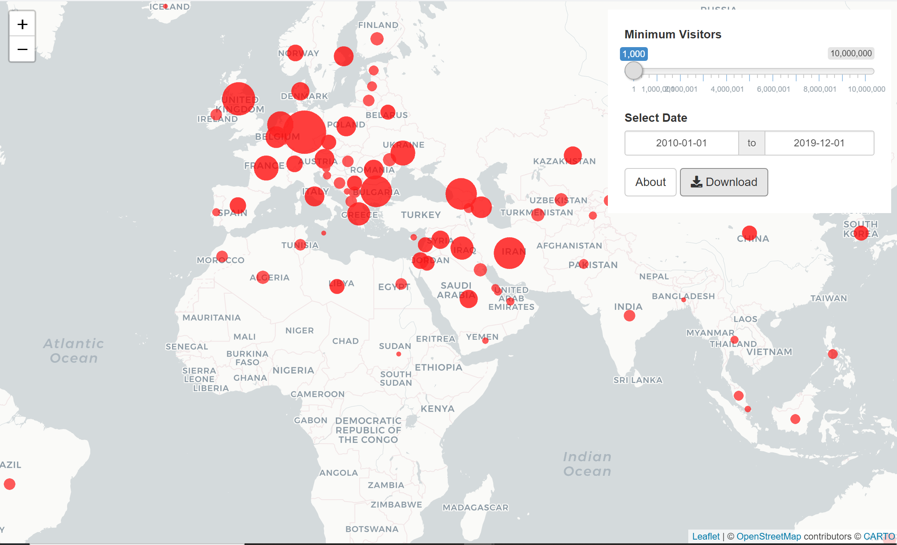

# Introduction

- This [data](https://evds2.tcmb.gov.tr/) set is composed of the number of monthly tourist visits to Turkey according to the various nationalities. It has 103 variables/columns and 150 observations/rows.


- Columns represent the countries or regions which tourists came from, and the rows show the dates, month by month. Within the context of the project, our purpose is to investigate the dataset on a large scale.
---
# Key Takeaways

- Turkey’s incoming visitors with their nationalities data is analyzed.

- Seasonality analysis and effects of terrorism, development level, visa policy, exchange rates, distance on number of tourists are examined.

- Interesting results are found such as: 


◦Visitors mostly prefer summer season and number of visitors has an increasing trend throughout years except 2016 the year terrorism data peaks with the coup attempt and 2020 the year COVID-19 epidemic spreads.  
 
 
◦ HDI, an index indicating development level of a country, analysis shows Turkey hosts tourists more from developed countries.
 
 
◦ Political issues also have an impact on number of tourist. While number of Russian tourists has an increasing trend till 2015, it starts to decrease suddenly in 2015. This is most probably because of retrograde relationship of Russia and Turkey after the Russian plane crash made by Turkey. Then, the number increases again with the normalization process at the end of 2016.


---


# Total visitors from countries by year and month

```{r download, message=FALSE,include=FALSE,warning=FALSE}
library(dplyr)
library(ggplot2)
library(tidyr)
library(tidyverse)
library(lubridate)
library(readxl)
library(forecast)
library(zoo)
library(janitor)
library(plotly)
library(rmarkdown)
library(stringi)
library(scales)
library(textshape)
setwd("C:/Users/Suhey/OneDrive/Masaüstü/IE48A")
raw_df <- read_excel("milliyetlere_gore_ziyaretci_sayisi.xlsx")
ter<-read.csv("globalterrorism_turkey.csv")

```

```{r preprocess, message=FALSE,echo=FALSE,include=FALSE,warning=FALSE}
#Parsing the Date column and changing them to required format
raw_df$Date <- parse_date_time(raw_df$Date, "ym")

raw_df %>% select(Date) %>% glimpse()

#Let's form another data frame not including the totals
df <- raw_df %>% select(-contains("Total")) 

#These are the unique country names
countries <- df %>% select(-Date) %>% colnames()
```

```{r topbottom, message=FALSE,echo=FALSE,include=FALSE, warning=FALSE}
totalsums <- df %>% select(-Date) %>% summarise(across(everything(),sum)) %>% sort(decreasing = TRUE) 
top10_s <- t(totalsums %>% select(1:10))
last10_s <- t(totalsums %>% select(87:96))
top10_s
last10_s

totalmeans <- df %>% select(-Date) %>% summarise(across(everything(),mean)) %>% sort(decreasing = TRUE) 
top10_m <- t(totalmeans %>% select(1:10))
last10_m <- t(totalmeans %>% select(87:96))
top10_m
last10_m
```

```{r together, message=FALSE,echo=FALSE,include=FALSE, warning=FALSE}
top10 <- bind_cols(means = top10_m, sums= top10_s, names= rownames(top10_m)) 
last10 <- bind_cols(means = last10_m, sums= last10_s, names= rownames(last10_m)) 

```

- We analyzed which countries visited Turkey the most and the least, both in terms of total tourists and average tourists per month and the number of visitors by those countries. The top 10 countries that visited Turkey the most are given below:
```{r,fig.height=5, fig.width=10,fig.align = 'center', message=FALSE,echo=FALSE, warning=FALSE}
top10  %>% ggplot(aes(x=names, y=means, fill=names)) + geom_col() +theme_minimal() + theme(legend.position = "None")+labs(x="Country",y="Average Number of Tourists",title="Countries from which Tourists Come the Most") 
```
---
- The top 10 countries that visited Turkey the least are given below:
```{r,fig.height=6, fig.width=10,fig.align = 'center', message=FALSE, warning=FALSE}
last10 %>% ggplot(aes(x=names, y=means,fill=names)) + geom_col() +theme_minimal() +  theme(legend.position = "None",axis.text.x = element_text(angle = 45)) +
  labs(x="Country",y="Average Number of Tourists",title="Countries from which Tourists Come the Least")
```
---
```{r most, message=FALSE,echo=FALSE,include=FALSE, warning=FALSE}
#Creating a data frame with yearly aggregates
year_df <- df %>% mutate(Year= year(Date)) %>% select (-Date) %>% relocate(Year) %>% group_by(Year) %>% summarise_all(list(sum))

#Finding the name of the country which is maximum of each year
year_df$max = names(year_df)[apply(year_df, 1, which.max)]
year_df %>% select(Year,max)

month_df <- df %>% mutate(Month= month(Date)) %>% select (-Date) %>% relocate(Month) %>% group_by(Month) %>% summarise_all(list(sum))

#Finding the name of the country which is maximum of each year
month_df$max = names(month_df)[apply(month_df, 1, which.max)]
month_df %>% select(Month,max)
```

```{r continents, message=FALSE,echo=FALSE,include=FALSE, warning=FALSE}
total_df <- raw_df %>% select("Date" | contains("Total"))
```

- Continents the tourists came from the most.
```{r,fig.height=6, fig.width=10,fig.align = 'center',message=FALSE, warning=FALSE}
total_df %>% pivot_longer(.,-Date) %>% ggplot(.,aes(x=Date,y=value,color=name)) + geom_line()+labs(x="Date", y="Number of Tourists",title="Number of Tourists by Continents",color="Continents")
```
---


- It's worth checking the months in which the most tourists visited Turkey. 
```{r seasons,fig.height=6, fig.width=10,fig.align = 'center',message=FALSE, warning=FALSE}
monthly_sum <- raw_df %>% mutate(month=month(Date)) %>% select(`Grand Total`,month,-Date) %>% relocate(month) %>% group_by(month) %>% summarise(sum=sum(`Grand Total`))

ggplot(monthly_sum) + geom_col(aes(x=month,y=sum)) + labs(title = "Visitors by Month", x="Month", y="Number of visitors") + theme_minimal() 

```

---
- The effect of seasonality can be seen below.
```{r seosonality,fig.height=6, fig.width=10,fig.align = 'center',echo=FALSE, message=FALSE, warning=FALSE}
ts <- ts(total_df$`Grand Total`, frequency = 12, start = 2008) 
decomposed <- decompose(ts, type="additive")
plot(decomposed)

```
- The decomposed plot shows us there is an increased trend, however in 2016, there is a significant drop in the number of tourists, which can be attributed to the coup attempt during that summer.
---
- This is the original plot of the data:
```{r seosonality2,fig.height=6, fig.width=10,fig.align = 'center', message=FALSE, warning=FALSE}
total_df %>% ggplot(aes(x=Date,y=`Grand Total`)) +geom_line() + theme_minimal()+
  labs(title="Total Number of Tourists with Seasonality",y="Number of Tourists")
```
---
- This is the deseasonalized version of the data:
```{r seosonality3,fig.height=6, fig.width=10,fig.align = 'center', message=FALSE, warning=FALSE}
ts.stl <- stl(ts,"periodic") 
ts.sa <- seasadj(ts.stl) 
total_df %>% ggplot(aes(x=Date, y= ts.sa)) +geom_line() + theme_minimal()+
  labs(title="Total Number of Tourists without Seasonality",y="Number of Tourists")
``` 

---
- The effect of Covid-19 can be seen the tourist data in 2020.
```{r seosonality4,fig.height=6, fig.width=10,fig.align = 'center',echo=FALSE, message=FALSE, warning=FALSE}
seasonplot(ts.sa, 12, col=rainbow(13), season.labels=TRUE, year.labels=TRUE, main="Seasonal Visitors") 
```
- We can see that the tourist data in 2020 is very different than the rest and downwards trending due to Covid-19.
---
#Relation Between Number of Visitors and Terrorism in Turkey
- The plot with two scales represent the correlation between the number of tourists and terrorism statistics.

```{r,message=FALSE,echo=FALSE,include=FALSE,warning=FALSE}
data_tourist<-raw_df
```

```{r,message=FALSE,echo=FALSE,include=FALSE,warning=FALSE}
terrorism_turkey<-ter%>%filter(country_txt=="Turkey")%>%filter(iyear>=2008)
terrorism_turkey$natlty1_txt=NULL
colnames(terrorism_turkey)[6]  <- "City"
colnames(terrorism_turkey)[7]  <- "County"
```

```{r,message=FALSE,echo=FALSE,include=FALSE,warning=FALSE}
number_of_events_year<-terrorism_turkey%>%group_by(iyear)%>%count()
number_of_events_month<-terrorism_turkey%>%group_by(imonth,iyear)%>%count()
colnames(number_of_events_year)[2]  <- "total"
colnames(number_of_events_year)[1]  <- "Year"
number_of_events_year$Year<- as.Date(as.character(number_of_events_year$Year), format = "%Y")
```

```{r,message=FALSE,echo=FALSE,include=FALSE,warning=FALSE}
data_tourist_year<-data_tourist%>%pivot_longer(cols=-Date,names_to="Country", values_to="Visits")%>%group_by(Country,year(Date))%>%summarise(Total_year=sum(Visits))
colnames(data_tourist_year)[2]  <- "Year"
colnames(data_tourist_year)[3]  <- "Visits"
```

```{r,message=FALSE,echo=FALSE,include=FALSE,warning=FALSE}
terrorismBycity<-terrorism_turkey%>%group_by(City, iyear)%>%count()
colnames(terrorismBycity)[2]  <- "Year"


yearly_total_visits<-data_tourist_year%>%group_by(Year)%>%summarize(total=sum(Visits))
yearly_total_visits$Year<- as.Date(as.character(yearly_total_visits$Year), format = "%Y")
class(yearly_total_visits$Year)
```

```{r,fig.height=4, fig.width=10,fig.align = 'center',message=FALSE,echo=FALSE, warning=FALSE}
ggplot() + 
  geom_bar(mapping = aes(x = yearly_total_visits$Year, y = yearly_total_visits$total), stat = "identity", fill = "black") +
  geom_line(mapping = aes(x = number_of_events_year$Year, y = number_of_events_year$total*100000), size = 2, color = "blue") + 
  scale_x_date(name = "Years") +
  scale_y_continuous(name = "number of tourists", 
                     sec.axis = sec_axis(~./100000, name = "terrorism", 
                                         labels = function(b) { paste0(b)})) + 
  theme(
    axis.title.y = element_text(color = "black"),
    axis.title.y.right = element_text(color = "blue"))+
  labs(title="Average Number of Tourists with the Terrorism Level (yearly)")
```
- As the graph illustrates, it is hard to say that there is no correlation between the number of terrorisms in Turkey and the number of tourists in Turkey. 

---
# Relation Between Number of Visitors and Development Level of Their Countries 
- We used multiple development indicators to analyze number of visitors with respect to the development levels of their countries.  

Indicators used:  
- GDP per capita  
- Life expectancy  
- Human Development Index   
---

```{r,message=FALSE,echo=FALSE,include=FALSE,warning=FALSE}
Sys.setlocale("LC_TIME", "C")
```

```{r, message=FALSE,echo=FALSE,include=FALSE,warning=FALSE}
setwd("C:/Users/Suhey/OneDrive/Masaüstü/IE48A")
raw_data <- read_xlsx("milliyetlere_gore_ziyaretci_sayisi.xlsx")

raw_data <- raw_data %>%
   mutate(Date=as.yearmon(Date))
```

```{r,message=FALSE,echo=FALSE,include=FALSE,warning=FALSE}
years_total <- raw_data %>%
  t()
colnames(years_total)=years_total[1,]
years_total <- years_total[-1,]

years_total <- as.data.frame(years_total)
years_total <- rownames_to_column(years_total, "Country Name")

years_total[,2:151] <- as.numeric(unlist(years_total[,2:151]))

years_total<- years_total %>%
  rowwise() %>%
  mutate( sum_2008=sum(c_across(`Jan 2008`:`Dec 2008`)),
          sum_2009=sum(c_across(`Jan 2009`:`Dec 2009`)),
          sum_2010=sum(c_across(`Jan 2010`:`Dec 2010`)),
          sum_2011=sum(c_across(`Jan 2011`:`Dec 2011`)),
          sum_2012=sum(c_across(`Jan 2012`:`Dec 2012`)),
          sum_2013=sum(c_across(`Jan 2013`:`Dec 2013`)),
          sum_2014=sum(c_across(`Jan 2014`:`Dec 2014`)),
          sum_2015=sum(c_across(`Jan 2015`:`Dec 2015`)),
          sum_2016=sum(c_across(`Jan 2016`:`Dec 2016`)),
          sum_2017=sum(c_across(`Jan 2017`:`Dec 2017`)),
          sum_2018=sum(c_across(`Jan 2018`:`Dec 2018`)),
          sum_2019=sum(c_across(`Jan 2019`:`Dec 2019`)),
          avg_2008to2018_yearly=mean(c_across(`Jan 2008`:`Dec 2018`))*12
  ) %>%
  select('Country Name', sum_2008:sum_2019, avg_2008to2018_yearly)
```

```{r,message=FALSE,echo=FALSE,include=FALSE,warning=FALSE}
setwd("C:/Users/Suhey/OneDrive/Masaüstü/IE48A")
GDP_per_capita_data <- read_xls("GDP_per_capita.xls")
GDP_per_capita_data %>%
  glimpse()

GDP_per_capita_data <- GDP_per_capita_data %>%
  select(`Country Name`,`2008`:`2019`) 

GDP_per_capita_data <- as.data.frame(GDP_per_capita_data)
```

```{r, fig.align='center',message=FALSE,echo=FALSE,include=FALSE,warning=FALSE}
colnames(GDP_per_capita_data)[2:13] <- paste0("GDP_per_capita_", colnames(GDP_per_capita_data)[2:13])

joined_data_GDP_per_capita <- years_total %>%
  inner_join(GDP_per_capita_data, by=c(`Country Name`= 'Country Name' )) %>%
  mutate(avg_GDPperCap_2008to2018=mean(c_across(GDP_per_capita_2008:GDP_per_capita_2018), na.rm = TRUE))

```


```{r,message=FALSE,echo=FALSE,include=FALSE,warning=FALSE}
q1 <- quantile(joined_data_GDP_per_capita$avg_GDPperCap_2008to2018, na.rm = TRUE)

joined_data_GDP_per_capita <- joined_data_GDP_per_capita %>%
  mutate(GDP_per_capita_level=case_when((avg_GDPperCap_2008to2018>=q1[1]&avg_GDPperCap_2008to2018<q1[2])~"very low",
                                        (avg_GDPperCap_2008to2018>=q1[2]&avg_GDPperCap_2008to2018<q1[3])~"low",
                                        (avg_GDPperCap_2008to2018>=q1[3]&avg_GDPperCap_2008to2018<q1[4])~"medium",
                                        (avg_GDPperCap_2008to2018>=q1[4]&avg_GDPperCap_2008to2018<=q1[5])~"high" 
                                        )
         )
```
- Average GDP per capita plot with respect to average yearly visitors, colored by GDP per capita level is given below.
```{r,fig.height=5, fig.width=10,fig.align = 'center',warning=FALSE,message=FALSE}
joined_data_GDP_per_capita %>%
  ggplot(aes(x=avg_2008to2018_yearly,y=avg_GDPperCap_2008to2018, color=GDP_per_capita_level),fig.align='center')+
  geom_point()+
  labs(x="2008-2018 yearly number of visitors average", y="2008-2018 average GDP per capita") +
  scale_color_discrete(name="GDP per capita levels of countries")

```

```{r,message=FALSE,echo=FALSE,include=FALSE,warning=FALSE}
GDP_per_capita_level_grouped <- joined_data_GDP_per_capita %>%
  group_by(GDP_per_capita_level) %>%
  summarise(sum=sum(avg_2008to2018_yearly))
```
---
- Pie chart for GDP per capita is given below.
```{r,fig.height=5, fig.width=10,fig.align = 'center'}
ggplot(GDP_per_capita_level_grouped, aes(x="",y=sum,fill=GDP_per_capita_level))+geom_bar(stat="identity",width=1)+coord_polar("y")+labs(x="",y="Total yearly average visitors") +scale_fill_discrete(name="GDP per capita levels of countries")
```
- Top 5 countries whose citizens visited Turkey the most belong either high or low GDP per capita levels.
- It is worth to mention that people whose countries belong to the medium category do not visit Turkey much, unlike high and low categories.     

```{r,message=FALSE,echo=FALSE,include=FALSE,warning=FALSE}
setwd("C:/Users/Suhey/OneDrive/Masaüstü/IE48A")
life_expectancy_data <- read_xls("Life_expectancy.xls")

life_expectancy_data %>%
  glimpse()

life_expectancy_data <- life_expectancy_data %>%
  select(`Country Name`,`2008`:`2018`)

life_expectancy_data <- as.data.frame(life_expectancy_data)

```

```{r fig.align='center',message=FALSE,echo=FALSE,include=FALSE,warning=FALSE}
colnames(life_expectancy_data)[2:12] <- paste0("life_expectancy_", colnames(life_expectancy_data)[2:12])

joined_data_life_expectancy <- years_total %>%
  inner_join(life_expectancy_data, by=c('Country Name'='Country Name')) %>%
  mutate(avg_life_expectancy_2008to2018=mean(c_across(life_expectancy_2008:life_expectancy_2018)))

```

---
```{r,message=FALSE,echo=FALSE,include=FALSE,warning=FALSE}

q2 <- quantile(joined_data_life_expectancy$avg_life_expectancy_2008to2018, na.rm = TRUE)

joined_data_life_expectancy <- joined_data_life_expectancy %>%
  mutate(life_expectancy_level=case_when((avg_life_expectancy_2008to2018>=q2[1]&avg_life_expectancy_2008to2018<q2[2])~"very low",
                                        (avg_life_expectancy_2008to2018>=q2[2]&avg_life_expectancy_2008to2018<q2[3])~"low",
                                        (avg_life_expectancy_2008to2018>=q2[3]&avg_life_expectancy_2008to2018<q2[4])~"medium",
                                        (avg_life_expectancy_2008to2018>=q2[4]&avg_life_expectancy_2008to2018<=q2[5])~"high" 
  )
  )
joined_data_life_expectancy$life_expectancy_level <- factor(joined_data_life_expectancy$life_expectancy_level, levels = c("high", "medium","low","very low"))

```
- The average life expectancy with respect to average yearly visitors, colored by life expectancy level of countries is given below.
```{r,fig.height=5, fig.width=10,fig.align = 'center',warning=FALSE,message=FALSE}
joined_data_life_expectancy %>%
  ggplot(aes(x=avg_2008to2018_yearly,y=avg_life_expectancy_2008to2018, color=life_expectancy_level)) +
  geom_point()+
  labs(x="2008-2018 yearly number of visitors average", y="2008-2018 average life expectancy") +
  scale_color_discrete(name="Life expectancy levels of countries")

```

```{r,message=FALSE,echo=FALSE,include=FALSE,warning=FALSE}
life_expectancy_level_grouped <- joined_data_life_expectancy %>%
  group_by(life_expectancy_level) %>%
  summarise(sum=sum(avg_2008to2018_yearly))
```
---
- Similarly we do not see many medium level countries in top countries, except Germany. Unlike the pie chart for GDP per capita, life expectancy pie chart is not far from a equally divided pie.
```{r,fig.height=6, fig.width=10,fig.align = 'center'}

ggplot(life_expectancy_level_grouped, aes(x="",y=sum,fill=life_expectancy_level))+geom_bar(stat="identity",width=1)+coord_polar("y")+labs(x="",y="Total yearly average visitors")+scale_fill_discrete(name="Life expectancy levels of countries")
```

---

```{r,message=FALSE,echo=FALSE,include=FALSE,warning=FALSE}
setwd("C:/Users/Suhey/OneDrive/Masaüstü/IE48A")
HDI_data <- read_xlsx("Human_development_index_HDI.xlsx")

HDI_data %>%
  glimpse()

colnames(HDI_data) <- gsub("X","",colnames(HDI_data))

HDI_data <- HDI_data %>%
  select('Country Name'= Country, '2008':'2018')

HDI_data <- as.data.frame(HDI_data)

```

```{r,message=FALSE,echo=FALSE,include=FALSE,warning=FALSE}
colnames(HDI_data)[2:12] <- paste0("HDI_", colnames(HDI_data)[2:12])

HDI_data[,2:12] <- as.numeric(unlist(HDI_data[,2:12]))

joined_data_HDI <- years_total %>%
  inner_join(HDI_data, by=c('Country Name'='Country Name')) %>%
  mutate(avg_HDI_2008to2018=mean(c_across(HDI_2008:HDI_2018),na.rm = TRUE)) %>%
  mutate(HDI_level=case_when(avg_HDI_2008to2018>=0.8~"very high",
                             (avg_HDI_2008to2018<0.8&avg_HDI_2008to2018>=0.7)~"high",
                             (avg_HDI_2008to2018<0.7&avg_HDI_2008to2018>=0.55)~"medium",
                             avg_HDI_2008to2018<0.55~"low"
                             )
         )
joined_data_HDI$HDI_level <- factor(joined_data_HDI$HDI_level, levels = c("very high","high","medium","low"))

```

```{r,message=FALSE,warning=FALSE,include=FALSE}

HDI_level_grouped <- joined_data_HDI %>%
  group_by(HDI_level) %>%
  summarise(sum=sum(avg_2008to2018_yearly))

```
- We also wanted to analyze HDI levels by quantile, like we did with other metrics.
```{r, message=FALSE,warning=FALSE,include=FALSE}
q3 <- quantile(joined_data_HDI$avg_HDI_2008to2018, na.rm = TRUE)

joined_data_HDI <- joined_data_HDI %>%
  mutate(HDI_level_by_quantile=case_when((avg_HDI_2008to2018 >=q3[1]&avg_HDI_2008to2018<q3[2])~"very low",
                                         (avg_HDI_2008to2018>=q3[2]&avg_HDI_2008to2018<q3[3])~"low",
                                         (avg_HDI_2008to2018>=q3[3]&avg_HDI_2008to2018<q3[4])~"medium",
                                         (avg_HDI_2008to2018>=q3[4]&avg_HDI_2008to2018<=q3[5])~"high" 
  )
  )

HDI_level_by_quantile_grouped <- joined_data_HDI %>%
  group_by(HDI_level_by_quantile) %>%
  summarise(sum=sum(avg_2008to2018_yearly))

```

```{r,fig.height=6, fig.width=10,fig.align = 'center'}
joined_data_HDI %>%
  ggplot(aes(x=avg_2008to2018_yearly,y=avg_HDI_2008to2018, color=HDI_level_by_quantile)) +
  geom_point()
```
---
- HDI  level quantile pie chart is given below.
```{r,fig.height=6, fig.width=10,fig.align = 'center'}
ggplot(HDI_level_by_quantile_grouped, aes(x="",y=sum,fill=HDI_level_by_quantile))+geom_bar(stat="identity",width=1)+coord_polar("y")+labs(x="",y="Total yearly average visitors")+scale_fill_discrete(name="HDI levels of countries (by quantile)")


```
---
# The Effect of Visa Policy of Turkey


```{r,message=FALSE,echo=FALSE,include=FALSE,warning=FALSE}
setwd("C:/Users/Suhey/OneDrive/Masaüstü/IE48A")
data<-read_excel("milliyetlere_gore_ziyaretci_sayisi.xlsx")
```

```{r,message=FALSE,echo=FALSE,include=FALSE,warning=FALSE}
setwd("C:/Users/Suhey/OneDrive/Masaüstü/IE48A")
visa<-read_excel("vize_muafiyeti.xlsx")
```


```{r,message=FALSE,echo=FALSE,include=FALSE,warning=FALSE}
data$Date <- parse_date_time(data$Date, "ym")
```

```{r,message=FALSE,echo=FALSE,include=FALSE,warning=FALSE}
data_transpose<-data%>%pivot_longer(cols=-Date,names_to="Free Visa")
```

```{r,message=FALSE,echo=FALSE,include=FALSE,warning=FALSE}
data_year<-data_transpose%>%group_by(year(Date), `Free Visa`)%>%summarise(total=sum(value))
```


```{r,message=FALSE,echo=FALSE,include=FALSE,warning=FALSE}
data_countries<-data%>%select(-Date)%>%names()
```


```{r,message=FALSE,echo=FALSE,include=FALSE,warning=FALSE}
free_visa_df<- data_transpose%>%inner_join(visa,by="Free Visa")
free_visa_df[,4]<-1
colnames(free_visa_df)[4]  <- "Visa"
colnames(free_visa_df)[2]  <- "Country"
```


```{r,message=FALSE,echo=FALSE,include=FALSE,warning=FALSE}
no_visa_df<-data_transpose%>%anti_join(visa,by="Free Visa")
no_visa_df[,4]<-0
colnames(no_visa_df)[4]  <- "Visa"
colnames(no_visa_df)[2]  <- "Country"
```


```{r,message=FALSE,echo=FALSE,include=FALSE,warning=FALSE}
#1 means free visa
#0 means that visa is needed

total_data<- free_visa_df%>%full_join(no_visa_df,by=c("Visa","Date","Country","value"))
```


```{r,message=FALSE,echo=FALSE,include=FALSE,warning=FALSE}
sum_data<-total_data%>%group_by(Country,Visa, year(Date))%>%summarise(total=sum(value))
sum_byvisa<-total_data%>%group_by(Visa)%>%summarise(mean=mean(value),total=sum(value))
```

```{r,message=FALSE,echo=FALSE,include=FALSE,warning=FALSE}
ranked_final<-sum_data%>%arrange(desc(total))  
ranked_final<-ranked_final[!grepl("Total|Africa|Other", ranked_final$Country),]
head(ranked_final,10)
tail(ranked_final,10)
```
- The points show the number of total visits to Turkey, country by country. Red points state that this country on the x-axis is not allowed to enter Turkey without visa. Blue dots represent that free-visa countries, which are free to enter the country without visa.

```{r,fig.height=7, fig.width=12,fig.align = 'center', message=FALSE,echo=FALSE, warning=FALSE}

ggplot(ranked_final,aes(x=Country,y=total,color=factor(Visa)))+
  geom_point()+
  scale_y_continuous(labels = unit_format(unit = "M", scale = 1e-6))+
  theme(axis.text.x = element_text(angle = 80, vjust = .5))+
  labs(y="Total Number of Tourists (yearly)", title="Number of Tourists vs Countries with Turkey's Visa Policy", color="Visa Policy")
```

---
# Analysis of Exchange Rates and Visitors 
- In this part, an analysis of change of exchange rates ,and whether it has salient effects on the number of tourists is conducted. 
```{r Data_Preprocessing,message=FALSE,echo=FALSE,include=FALSE,warning=FALSE }
setwd("C:/Users/Suhey/OneDrive/Masaüstü/IE48A")
mil <- read_xlsx("milliyetlere_gore_ziyaretci_sayisi.xlsx")

mil <- mil %>%
  mutate(Date=as.yearmon(Date)) %>% mutate(Date=as.Date(Date))

euro_dolar<- read_csv("euro-dollar.csv",guess_max = 100,
                      col_types = cols(
                        "Tarih" = col_date(format="%Y-%m"),
                        "TP DK EUR A YTL" = col_number(),
                        "TP DK USD A YTL" = col_number()
                      ))
#NA values stems from the source information etc

#rename

names(euro_dolar)=c("Date", "euro_tl_exchange_rate","dollar_tl_exchange_rate") 

#getting related columns

euro_dolar_tidy<-euro_dolar %>%
  as.data.frame %>%
  slice(1:150) 

#preparing data for visualization

euro_dolar_2<-euro_dolar_tidy%>%
  pivot_longer(!Date,names_to="exchange_type",values_to="rate")

```
**Exchange Rate Analysis**
- The change in the exchange rates of both EURO and DOLLAR is examined from the first month of 2008 untill sixth month of 2020.
```{r,fig.height=4, fig.width=10,plotting_exchange_rate, fig.align = 'center',echo=FALSE, message=FALSE, warning=FALSE}
#ploting line graph to see exchange rate by time
ggplot<-ggplot(euro_dolar_2,aes(Date,rate,color=exchange_type))+ 
  geom_line(size=1)+
  labs(x="Years", y="Exchange rate", title="Exchange Rate by Years(2008-2020)")+
  theme_minimal()
ggplotly(ggplot)
```
- From the graph, it can be observed that, within the given time frame, euro and dollar tend to increase correlatedly, euro being slightly higher than dollar. Thus, Turkish Lira has been in a trend of losing value for years.
---
**Number of Visitor and Exchange Rate Comparison**
- In this part, total number of visitors from Europe and USA, and the change of exchange rate in Euro and Dollar is examined to better understand if a correlation and/or trend exist between the two. 
```{r joining two datasets,message=FALSE,echo=FALSE,include=FALSE,warning=FALSE }
usa_and_total_europe<-mil[1:150,c("Date","United States","Total Europe")]

#joining two data_sets(Here, we observe that it is perfectly matched.(i.e no NA field))
joined_data<-usa_and_total_europe %>%
  left_join(euro_dolar_tidy,by=c("Date"))
```

```{r joined_data,message=FALSE,echo=FALSE,include=FALSE,warning=FALSE }
head(joined_data)
```

```{r,fig.height=5, fig.width=10,Exchange_rate_Total_visitor_comparison_Europe, echo=FALSE,warning=FALSE, fig.align = 'center', message=FALSE, warning=FALSE}
ggplot2<-joined_data %>%
    select(c(Date,euro_tl_exchange_rate,`Total Europe`)) %>%
    slice(-1) %>%
    pivot_longer(!Date)%>%
    ggplot(.,aes(x=Date,y=value,color=name))+
    geom_line()+
    theme(legend.position = "none")+
    xlim(min(joined_data$Date),max(joined_data$Date))+
    facet_wrap(~name,scales="free")
  ggplotly(ggplot2,width=700, height=300)
```

- By examining both of the graphs, it can be observed that total number of tourists from Europe to Turkey have an oscillating shape, which means the change in the number of visitors is seasonal( most visitors can be observed during summer months) rather than being correlated with the exchange rate of Euro/TL.
---
- Visualization of total visitors from USA and Dollar/TL exchange rate is given below.
```{r,fig.height=6, fig.width=10, Exchange_rate_Total_visitor_comparison_USA, echo=FALSE, fig.align = 'center', message=FALSE, warning=FALSE}
ggplot3<-joined_data %>%
    select(c(Date,dollar_tl_exchange_rate,`United States`)) %>%
    slice(-1) %>%
    pivot_longer(!Date)%>%
    ggplot(.,aes(x=Date,y=value,color=name))+
    geom_line()+
    theme(legend.position = "none")+
    xlim(min(joined_data$Date),max(joined_data$Date))+
    facet_wrap(~name,scales="free")
  ggplotly(ggplot3,width=700, height=300)
```
- Similar seasonality can be observed in the number of USA visitors as in Europe. However, the month where peak value in the number of visitors is seen slightly differs from European Tourists, and also between the years.
---
# The Effect of Distance Between Turkey and the Other Countries
- Distance (between Turkey and specified country) vector is created for each respectively to determine correlation between distance and number of tourists per year.
```{r, message=FALSE,echo=FALSE,include=FALSE,warning=FALSE }
cor_data<-c()

for (i in 2008:2020){
data<-raw_data%>%
  select(-c('Haymatlos', 'Grand Total'))%>%
 filter(format(Date, "%Y")==i)%>%
 pivot_longer(.,cols = -Date,
             names_to = "names", 
          values_to = "values")%>%
  group_by(names)%>%
  summarise(avg=mean(values))

data1<-data[-c(2,4,7,8,15,24,25,27,28,36,37), ] 


distance<-c(10066,2350,13004,1295,12551,1977,1080,2500,2045,5389,1646,2709,1538,10708,915,1979,3189,6077,2637,
            9930,867,2314,3760,8849,2843,2793,7770,792,4566,1744,2682,3301,1048,1802,3596,3322,834,2896,2353,1905,
            4429,8686,8630,1386,2136,2818,3376,410,11286,1249,1575,2130,2063,2000,579,2563,1506,1038,8756,1843,
            11801,1413,1054,3068,12427,2451,3337,1852,3674,1129,1873,13348,8105,1363,1638,1811,2604,518,1931,
            3091,6872,2381,2115,1137,894,10388,2884,16624,1122)

cor_data <- c(cor_data, cor(data1$avg,distance))

}
```

```{r, fig.height=3, fig.width=10,message=FALSE,echo=FALSE, warning=FALSE}
years<-c(2008:2020)
yearly_correlation<-data.frame(Years=years,Correlation=cor_data)
ggplot(yearly_correlation,aes(x=Years, y=Correlation))+geom_col()+ylim(-1,1)+theme_light()+
  scale_x_continuous(breaks = seq(2008, 2020, by = 1))+theme(axis.text.x=element_text(angle = 90))

```
- All the values lay below the zero line, which means there is a negative relationship.  However, it is clear that distance has no a big impact on number of tourists because absolute value of correlation values is almost zero.
---
# Forecast Plot for Germany
- By using `auto.arima` function and data of previous 150 months, the number of visitors from Germany are forecasted and plotted.
```{r, , message=FALSE,include=FALSE, warning=FALSE}
germany<-mil[1:150,c(1,2)]
germany_ts<-ts(germany)
fit<-auto.arima(germany_ts[,2])
summary(fit)
```

```{r,fig.height=6, fig.width=10, echo=FALSE}
fit%>%forecast()%>%autoplot()+
  labs(x="Date",y="Number of Visitors from Germany",title="Forecast of Number of Visitors from Germany")
```

---
# Shiny App

- Below you can see an image of our Shiny app. The link of the Shiny app is [here](https://irmakdai.shinyapps.io/project-shiny/).
```{r, echo=FALSE}

```
---

# Conclusion
Turkey is a country having high potential to attract tourists especially during summer season thanks to its nature, cultural and historical heritage, long coastline with beautiful beaches. Preference of tourists can be Turkey because of the touristic potential or not due to some other reasons. 

In this analysis, number of tourists is examined in detail with different aspects such as:

- Terrorism in Turkey 

- Development of the countries from which tourists come 

- Visa policy of Turkey 

- Exchange rates
---
- Distance between Turkey and the other countries:
 
When calculating correlation between distance and number of tourists, we see there is not a big impact of air distance on number of tourists because of low correlation result. Nevertheless, they have a negative relationship since all the values are negative. The reason why air distance does not affect much might be that transportation opportunities play bigger role today than air distance. 


---

# References

- [Main data](https://evds2.tcmb.gov.tr/)
- [GDP per capita data](https://data.worldbank.org/indicator/NY.GDP.PCAP.CD) 
- [Life expectancy data](https://data.worldbank.org/indicator/SP.DYN.LE00.IN)  
- [Human Development Index (HDI) data](http://hdr.undp.org/en/data)
- [Terrorism data](https://www.kaggle.com/behic1/terrorism-in-turkey)
- [Visa data](https://gocmenburo.com/turkiyenin-vize-istedigi-ulkeler)
- [Country Development](https://en.wikipedia.org/wiki/Developed_country)
- [Datacamp, Building Web Applications with Shiny in R](https://learn.datacamp.com/courses/building-web-applications-with-shiny-in-r) 


---

class: center, middle

# Thanks for listening!


